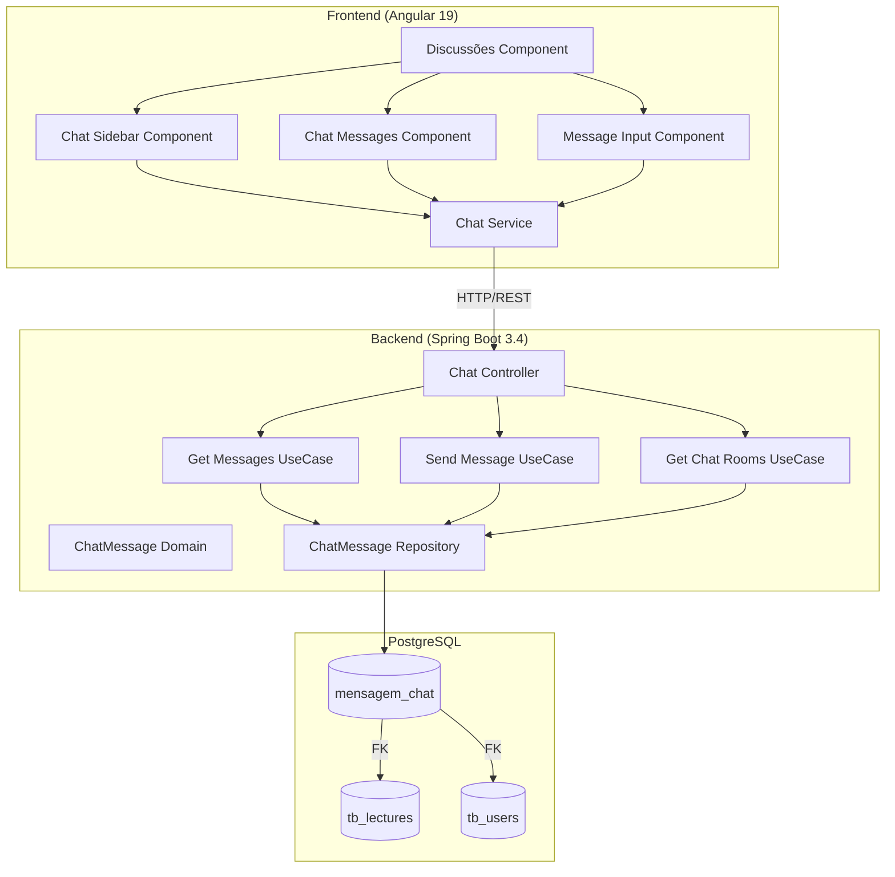
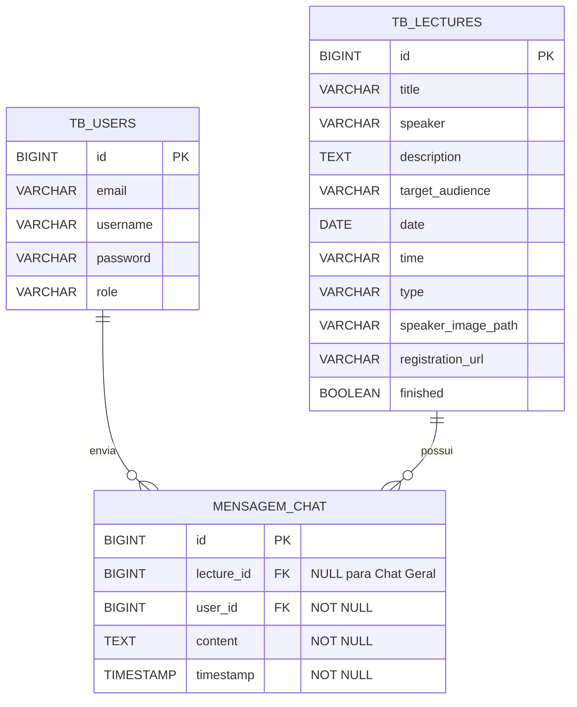
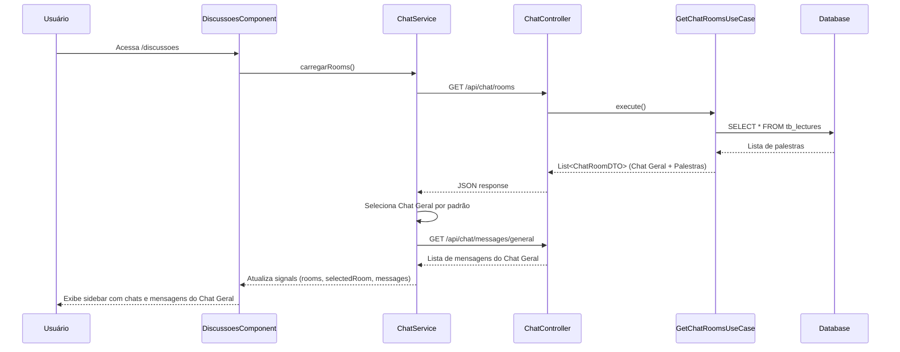
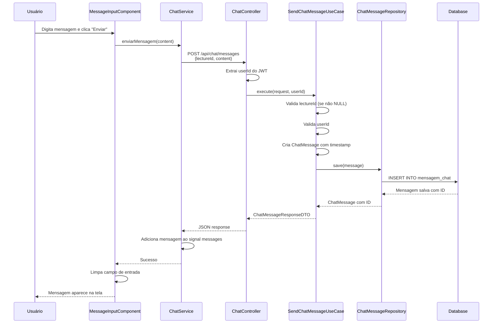
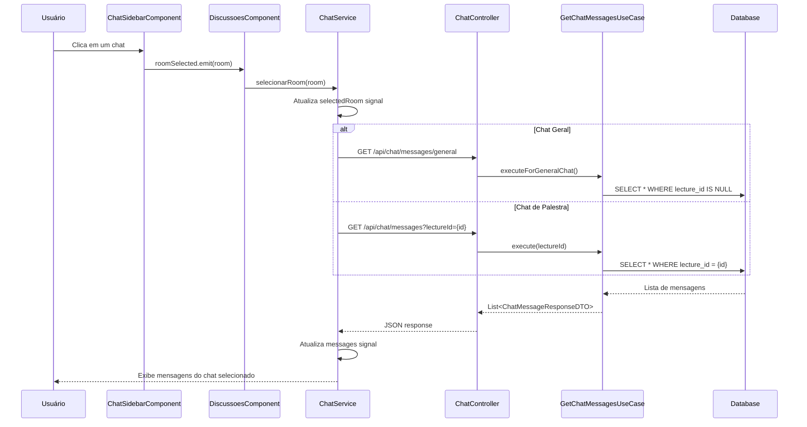
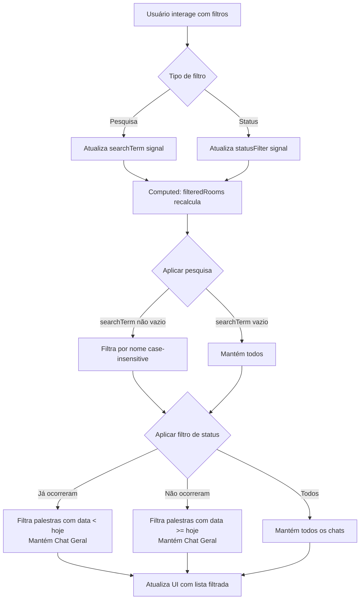
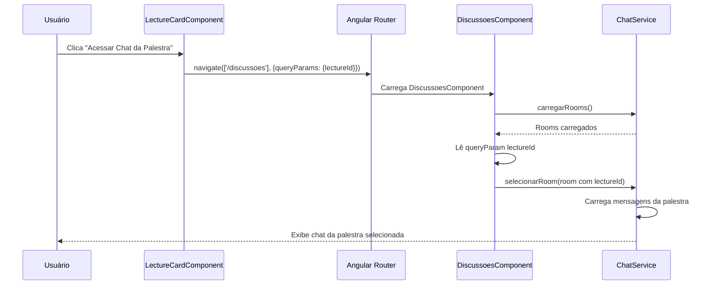

# Design Técnico - Sistema de Chat/Fórum de Palestras

## Overview

O sistema de chat/fórum de palestras é uma funcionalidade que permite discussões assíncronas vinculadas a palestras específicas ou em um chat geral. A solução integra-se à arquitetura existente do projeto, seguindo os padrões estabelecidos de DDD no backend (Java 21 Spring Boot 3.4) e feature-based no frontend (Angular 19).

O sistema suporta:
- Chat específico por palestra (1:N entre Lecture e ChatMessage)
- Chat geral não vinculado a palestras (lectureId NULL)
- Autenticação obrigatória via JWT
- Filtros por status de palestra e pesquisa por nome
- Interface responsiva com sidebar de navegação e área de mensagens

## Architecture

### Visão Geral da Arquitetura



### Camadas e Responsabilidades

**Backend (Java Spring Boot):**
- **Web Layer**: ChatController expõe endpoints REST para operações de chat
- **Application Layer**: UseCases orquestram lógica de negócio, DTOs transportam dados
- **Domain Layer**: ChatMessage (entidade de domínio), ChatMessageRepository (interface)
- **Infrastructure Layer**: ChatMessageEntity (JPA), ChatMessageRepositoryImpl, Mappers

**Frontend (Angular):**
- **Feature Layer**: discussoes/ contém componentes específicos da funcionalidade
- **Core Layer**: ChatService gerencia estado e comunicação HTTP
- **Shared Layer**: Componentes reutilizáveis (se necessário)

### Fluxo de Dados Principal

1. Usuário autenticado acessa /discussoes
2. Frontend carrega lista de chats disponíveis (GET /api/chat/rooms)
3. Usuário seleciona um chat (palestra ou geral)
4. Frontend busca mensagens (GET /api/chat/messages?lectureId={id} ou /api/chat/messages/general)
5. Mensagens são exibidas com distinção visual (próprias vs outros)
6. Usuário digita e envia mensagem (POST /api/chat/messages)
7. Frontend atualiza lista de mensagens localmente

## Components and Interfaces

### Backend Components

#### Domain Layer

**ChatMessage (Entidade de Domínio)**
```java
package br.com.senior.mes_conhecimento.domain.entities;

import java.time.LocalDateTime;

/**
 * Entidade de Domínio representando uma Mensagem de Chat.
 */
public class ChatMessage {
    private Long id;
    private Long lectureId;  // NULL para Chat Geral
    private Long userId;
    private String content;
    private LocalDateTime timestamp;
    
    // Construtor, getters, setters
    // Regras de negócio: validação de conteúdo não vazio
    
    public boolean isGeneralChat() {
        return lectureId == null;
    }
    
    public boolean isFromUser(Long userId) {
        return this.userId.equals(userId);
    }
}
```

**ChatMessageRepository (Interface de Domínio)**
```java
package br.com.senior.mes_conhecimento.domain.repositories;

import br.com.senior.mes_conhecimento.domain.entities.ChatMessage;
import java.util.List;

public interface ChatMessageRepository {
    ChatMessage save(ChatMessage message);
    List<ChatMessage> findByLectureIdOrderByTimestampAsc(Long lectureId);
    List<ChatMessage> findGeneralChatMessagesOrderByTimestampAsc();
}
```

#### Infrastructure Layer

**ChatMessageEntity (JPA Entity)**
```java
package br.com.senior.mes_conhecimento.infrastructure.persistence.entities;

import javax.persistence.*;
import java.time.LocalDateTime;

@Entity
@Table(name = "mensagem_chat", indexes = {
    @Index(name = "idx_lecture_timestamp", columnList = "lecture_id, timestamp"),
    @Index(name = "idx_user_id", columnList = "user_id")
})
public class ChatMessageEntity {
    @Id
    @GeneratedValue(strategy = GenerationType.IDENTITY)
    private Long id;
    
    @Column(name = "lecture_id")
    private Long lectureId;  // Nullable para Chat Geral
    
    @Column(name = "user_id", nullable = false)
    private Long userId;
    
    @Column(nullable = false, columnDefinition = "TEXT")
    private String content;
    
    @Column(nullable = false)
    private LocalDateTime timestamp;
    
    // Relacionamentos lazy para evitar N+1
    @ManyToOne(fetch = FetchType.LAZY)
    @JoinColumn(name = "lecture_id", insertable = false, updatable = false)
    private LectureEntity lecture;
    
    @ManyToOne(fetch = FetchType.LAZY)
    @JoinColumn(name = "user_id", insertable = false, updatable = false)
    private UserEntity user;
    
    // Construtor, getters, setters
}
```

**ChatMessageMapper**
```java
package br.com.senior.mes_conhecimento.infrastructure.persistence.mappers;

import br.com.senior.mes_conhecimento.domain.entities.ChatMessage;
import br.com.senior.mes_conhecimento.infrastructure.persistence.entities.ChatMessageEntity;

public class ChatMessageMapper {
    public static ChatMessage toDomain(ChatMessageEntity entity) {
        return new ChatMessage(
            entity.getId(),
            entity.getLectureId(),
            entity.getUserId(),
            entity.getContent(),
            entity.getTimestamp()
        );
    }
    
    public static ChatMessageEntity toEntity(ChatMessage domain) {
        ChatMessageEntity entity = new ChatMessageEntity();
        entity.setId(domain.getId());
        entity.setLectureId(domain.getLectureId());
        entity.setUserId(domain.getUserId());
        entity.setContent(domain.getContent());
        entity.setTimestamp(domain.getTimestamp());
        return entity;
    }
}
```

**ChatMessageJpaRepository**
```java
package br.com.senior.mes_conhecimento.infrastructure.persistence.repositories;

import br.com.senior.mes_conhecimento.infrastructure.persistence.entities.ChatMessageEntity;
import org.springframework.data.jpa.repository.JpaRepository;
import org.springframework.data.jpa.repository.Query;
import java.util.List;

public interface ChatMessageJpaRepository extends JpaRepository<ChatMessageEntity, Long> {
    List<ChatMessageEntity> findByLectureIdOrderByTimestampAsc(Long lectureId);
    
    @Query("SELECT c FROM ChatMessageEntity c WHERE c.lectureId IS NULL ORDER BY c.timestamp ASC")
    List<ChatMessageEntity> findGeneralChatMessagesOrderByTimestampAsc();
}
```

**ChatMessageRepositoryImpl**
```java
package br.com.senior.mes_conhecimento.infrastructure.persistence.repositories;

import br.com.senior.mes_conhecimento.domain.entities.ChatMessage;
import br.com.senior.mes_conhecimento.domain.repositories.ChatMessageRepository;
import br.com.senior.mes_conhecimento.infrastructure.persistence.mappers.ChatMessageMapper;
import org.springframework.stereotype.Repository;
import java.util.List;
import java.util.stream.Collectors;

@Repository
public class ChatMessageRepositoryImpl implements ChatMessageRepository {
    private final ChatMessageJpaRepository jpaRepository;
    
    public ChatMessageRepositoryImpl(ChatMessageJpaRepository jpaRepository) {
        this.jpaRepository = jpaRepository;
    }
    
    @Override
    public ChatMessage save(ChatMessage message) {
        ChatMessageEntity entity = ChatMessageMapper.toEntity(message);
        ChatMessageEntity saved = jpaRepository.save(entity);
        return ChatMessageMapper.toDomain(saved);
    }
    
    @Override
    public List<ChatMessage> findByLectureIdOrderByTimestampAsc(Long lectureId) {
        return jpaRepository.findByLectureIdOrderByTimestampAsc(lectureId)
            .stream()
            .map(ChatMessageMapper::toDomain)
            .collect(Collectors.toList());
    }
    
    @Override
    public List<ChatMessage> findGeneralChatMessagesOrderByTimestampAsc() {
        return jpaRepository.findGeneralChatMessagesOrderByTimestampAsc()
            .stream()
            .map(ChatMessageMapper::toDomain)
            .collect(Collectors.toList());
    }
}
```

#### Application Layer

**ChatMessageRequestDTO**
```java
package br.com.senior.mes_conhecimento.application.dtos;

import javax.validation.constraints.NotBlank;
import javax.validation.constraints.NotNull;

/**
 * DTO para requisição de envio de mensagem de chat.
 */
public record ChatMessageRequestDTO(
    Long lectureId,  // NULL para Chat Geral
    
    @NotBlank(message = "O conteúdo da mensagem não pode estar vazio")
    String content
) {}
```

**ChatMessageResponseDTO**
```java
package br.com.senior.mes_conhecimento.application.dtos;

import java.time.LocalDateTime;

/**
 * DTO para resposta de mensagem de chat.
 */
public record ChatMessageResponseDTO(
    Long id,
    Long lectureId,
    Long userId,
    String username,  // Nome do remetente para exibição
    String content,
    LocalDateTime timestamp
) {}
```

**ChatRoomDTO**
```java
package br.com.senior.mes_conhecimento.application.dtos;

import java.time.LocalDate;

/**
 * DTO representando um chat disponível (palestra ou geral).
 */
public record ChatRoomDTO(
    Long lectureId,  // NULL para Chat Geral
    String name,     // Nome da palestra ou "Chat Geral"
    LocalDate lectureDate,  // NULL para Chat Geral
    boolean isGeneral
) {}
```

**GetChatMessagesUseCase**
```java
package br.com.senior.mes_conhecimento.application.usecases.chat;

import br.com.senior.mes_conhecimento.application.dtos.ChatMessageResponseDTO;
import br.com.senior.mes_conhecimento.domain.repositories.ChatMessageRepository;
import br.com.senior.mes_conhecimento.domain.repositories.UserRepository;
import org.springframework.stereotype.Service;
import java.util.List;
import java.util.stream.Collectors;

@Service
public class GetChatMessagesUseCase {
    private final ChatMessageRepository chatMessageRepository;
    private final UserRepository userRepository;
    
    public GetChatMessagesUseCase(ChatMessageRepository chatMessageRepository, 
                                  UserRepository userRepository) {
        this.chatMessageRepository = chatMessageRepository;
        this.userRepository = userRepository;
    }
    
    public List<ChatMessageResponseDTO> execute(Long lectureId) {
        var messages = chatMessageRepository.findByLectureIdOrderByTimestampAsc(lectureId);
        
        return messages.stream()
            .map(msg -> {
                var user = userRepository.findById(msg.getUserId())
                    .orElseThrow(() -> new RuntimeException("Usuário não encontrado"));
                return new ChatMessageResponseDTO(
                    msg.getId(),
                    msg.getLectureId(),
                    msg.getUserId(),
                    user.getUsername(),
                    msg.getContent(),
                    msg.getTimestamp()
                );
            })
            .collect(Collectors.toList());
    }
    
    public List<ChatMessageResponseDTO> executeForGeneralChat() {
        var messages = chatMessageRepository.findGeneralChatMessagesOrderByTimestampAsc();
        
        return messages.stream()
            .map(msg -> {
                var user = userRepository.findById(msg.getUserId())
                    .orElseThrow(() -> new RuntimeException("Usuário não encontrado"));
                return new ChatMessageResponseDTO(
                    msg.getId(),
                    msg.getLectureId(),
                    msg.getUserId(),
                    user.getUsername(),
                    msg.getContent(),
                    msg.getTimestamp()
                );
            })
            .collect(Collectors.toList());
    }
}
```


**SendChatMessageUseCase**
```java
package br.com.senior.mes_conhecimento.application.usecases.chat;

import br.com.senior.mes_conhecimento.application.dtos.ChatMessageRequestDTO;
import br.com.senior.mes_conhecimento.application.dtos.ChatMessageResponseDTO;
import br.com.senior.mes_conhecimento.domain.entities.ChatMessage;
import br.com.senior.mes_conhecimento.domain.repositories.ChatMessageRepository;
import br.com.senior.mes_conhecimento.domain.repositories.LectureRepository;
import br.com.senior.mes_conhecimento.domain.repositories.UserRepository;
import org.springframework.stereotype.Service;
import java.time.LocalDateTime;

@Service
public class SendChatMessageUseCase {
    private final ChatMessageRepository chatMessageRepository;
    private final LectureRepository lectureRepository;
    private final UserRepository userRepository;
    
    public SendChatMessageUseCase(ChatMessageRepository chatMessageRepository,
                                  LectureRepository lectureRepository,
                                  UserRepository userRepository) {
        this.chatMessageRepository = chatMessageRepository;
        this.lectureRepository = lectureRepository;
        this.userRepository = userRepository;
    }
    
    public ChatMessageResponseDTO execute(ChatMessageRequestDTO request, Long authenticatedUserId) {
        // Validação: se lectureId não é NULL, palestra deve existir
        if (request.lectureId() != null) {
            lectureRepository.findById(request.lectureId())
                .orElseThrow(() -> new RuntimeException("Palestra não encontrada"));
        }
        
        // Validação: usuário deve existir
        var user = userRepository.findById(authenticatedUserId)
            .orElseThrow(() -> new RuntimeException("Usuário não encontrado"));
        
        // Criar mensagem de domínio
        ChatMessage message = new ChatMessage(
            null,
            request.lectureId(),
            authenticatedUserId,
            request.content(),
            LocalDateTime.now()
        );
        
        // Persistir
        ChatMessage saved = chatMessageRepository.save(message);
        
        // Retornar DTO
        return new ChatMessageResponseDTO(
            saved.getId(),
            saved.getLectureId(),
            saved.getUserId(),
            user.getUsername(),
            saved.getContent(),
            saved.getTimestamp()
        );
    }
}
```

**GetChatRoomsUseCase**
```java
package br.com.senior.mes_conhecimento.application.usecases.chat;

import br.com.senior.mes_conhecimento.application.dtos.ChatRoomDTO;
import br.com.senior.mes_conhecimento.domain.repositories.LectureRepository;
import org.springframework.stereotype.Service;
import java.util.ArrayList;
import java.util.List;

@Service
public class GetChatRoomsUseCase {
    private final LectureRepository lectureRepository;
    
    public GetChatRoomsUseCase(LectureRepository lectureRepository) {
        this.lectureRepository = lectureRepository;
    }
    
    public List<ChatRoomDTO> execute() {
        List<ChatRoomDTO> rooms = new ArrayList<>();
        
        // Adicionar Chat Geral como primeira opção
        rooms.add(new ChatRoomDTO(null, "Chat Geral", null, true));
        
        // Adicionar chats de palestras
        var lectures = lectureRepository.findAll();
        lectures.forEach(lecture -> 
            rooms.add(new ChatRoomDTO(
                lecture.getId(),
                lecture.getTitle(),
                lecture.getDate(),
                false
            ))
        );
        
        return rooms;
    }
}
```

#### Web Layer

**ChatController**
```java
package br.com.senior.mes_conhecimento.web.controllers;

import br.com.senior.mes_conhecimento.application.dtos.*;
import br.com.senior.mes_conhecimento.application.usecases.chat.*;
import org.springframework.http.ResponseEntity;
import org.springframework.security.core.Authentication;
import org.springframework.web.bind.annotation.*;
import javax.validation.Valid;
import java.util.List;

@RestController
@RequestMapping("/api/chat")
public class ChatController {
    private final GetChatMessagesUseCase getChatMessagesUseCase;
    private final SendChatMessageUseCase sendChatMessageUseCase;
    private final GetChatRoomsUseCase getChatRoomsUseCase;
    
    public ChatController(GetChatMessagesUseCase getChatMessagesUseCase,
                         SendChatMessageUseCase sendChatMessageUseCase,
                         GetChatRoomsUseCase getChatRoomsUseCase) {
        this.getChatMessagesUseCase = getChatMessagesUseCase;
        this.sendChatMessageUseCase = sendChatMessageUseCase;
        this.getChatRoomsUseCase = getChatRoomsUseCase;
    }
    
    /**
     * GET /api/chat/messages?lectureId={id}
     * Busca mensagens de uma palestra específica
     */
    @GetMapping("/messages")
    public ResponseEntity<List<ChatMessageResponseDTO>> getMessages(
            @RequestParam Long lectureId) {
        List<ChatMessageResponseDTO> messages = getChatMessagesUseCase.execute(lectureId);
        return ResponseEntity.ok(messages);
    }
    
    /**
     * GET /api/chat/messages/general
     * Busca mensagens do Chat Geral
     */
    @GetMapping("/messages/general")
    public ResponseEntity<List<ChatMessageResponseDTO>> getGeneralMessages() {
        List<ChatMessageResponseDTO> messages = getChatMessagesUseCase.executeForGeneralChat();
        return ResponseEntity.ok(messages);
    }
    
    /**
     * POST /api/chat/messages
     * Envia uma nova mensagem
     */
    @PostMapping("/messages")
    public ResponseEntity<ChatMessageResponseDTO> sendMessage(
            @Valid @RequestBody ChatMessageRequestDTO request,
            Authentication authentication) {
        Long userId = extractUserIdFromAuth(authentication);
        ChatMessageResponseDTO response = sendChatMessageUseCase.execute(request, userId);
        return ResponseEntity.ok(response);
    }
    
    /**
     * GET /api/chat/rooms
     * Lista todos os chats disponíveis
     */
    @GetMapping("/rooms")
    public ResponseEntity<List<ChatRoomDTO>> getRooms() {
        List<ChatRoomDTO> rooms = getChatRoomsUseCase.execute();
        return ResponseEntity.ok(rooms);
    }
    
    private Long extractUserIdFromAuth(Authentication authentication) {
        // Implementação depende de como o JWT armazena o userId
        // Exemplo: return ((UserDetails) authentication.getPrincipal()).getId();
        return 1L; // Placeholder
    }
}
```

### Frontend Components

#### Models

**chat-message.model.ts**
```typescript
export interface ChatMessage {
  id: number;
  lectureId: number | null;
  userId: number;
  username: string;
  content: string;
  timestamp: Date;
}

export interface ChatMessageState {
  messages: ChatMessage[];
  isLoading: boolean;
  error: string | null;
}
```

**chat-room.model.ts**
```typescript
export interface ChatRoom {
  lectureId: number | null;
  name: string;
  lectureDate: Date | null;
  isGeneral: boolean;
}

export interface ChatRoomState {
  rooms: ChatRoom[];
  selectedRoom: ChatRoom | null;
  isLoading: boolean;
  error: string | null;
}
```

#### Services

**chat.service.ts**
```typescript
import { Injectable, signal, computed, inject } from '@angular/core';
import { HttpClient, HttpParams } from '@angular/common/http';
import { ChatMessage, ChatMessageState } from '../models/chat-message.model';
import { ChatRoom, ChatRoomState } from '../models/chat-room.model';

@Injectable({
  providedIn: 'root',
})
export class ChatService {
  private http = inject(HttpClient);
  private readonly baseUrl = 'http://localhost:8080/api/chat';

  readonly #messageState = signal<ChatMessageState>({
    messages: [],
    isLoading: false,
    error: null,
  });

  readonly #roomState = signal<ChatRoomState>({
    rooms: [],
    selectedRoom: null,
    isLoading: false,
    error: null,
  });

  readonly messages = computed(() => this.#messageState().messages);
  readonly isLoadingMessages = computed(() => this.#messageState().isLoading);
  readonly rooms = computed(() => this.#roomState().rooms);
  readonly selectedRoom = computed(() => this.#roomState().selectedRoom);
  readonly isLoadingRooms = computed(() => this.#roomState().isLoading);

  /**
   * Carrega lista de chats disponíveis
   */
  carregarRooms(): void {
    this.#roomState.update(s => ({ ...s, isLoading: true }));
    
    this.http.get<ChatRoom[]>(`${this.baseUrl}/rooms`).subscribe({
      next: (rooms) => {
        const parsedRooms = rooms.map(r => ({
          ...r,
          lectureDate: r.lectureDate ? new Date(r.lectureDate) : null
        }));
        
        this.#roomState.set({
          rooms: parsedRooms,
          selectedRoom: parsedRooms[0] || null, // Seleciona Chat Geral por padrão
          isLoading: false,
          error: null
        });
        
        // Carrega mensagens do primeiro chat
        if (parsedRooms[0]) {
          this.selecionarRoom(parsedRooms[0]);
        }
      },
      error: (err) => {
        this.#roomState.update(s => ({
          ...s,
          isLoading: false,
          error: 'Erro ao carregar chats'
        }));
      }
    });
  }

  /**
   * Seleciona um chat e carrega suas mensagens
   */
  selecionarRoom(room: ChatRoom): void {
    this.#roomState.update(s => ({ ...s, selectedRoom: room }));
    this.carregarMensagens(room);
  }

  /**
   * Carrega mensagens de um chat específico
   */
  private carregarMensagens(room: ChatRoom): void {
    this.#messageState.update(s => ({ ...s, isLoading: true }));
    
    const url = room.isGeneral 
      ? `${this.baseUrl}/messages/general`
      : `${this.baseUrl}/messages`;
    
    const params = room.isGeneral 
      ? {}
      : { params: new HttpParams().set('lectureId', room.lectureId!.toString()) };
    
    this.http.get<ChatMessage[]>(url, params).subscribe({
      next: (messages) => {
        const parsedMessages = messages.map(m => ({
          ...m,
          timestamp: new Date(m.timestamp)
        }));
        
        this.#messageState.set({
          messages: parsedMessages,
          isLoading: false,
          error: null
        });
      },
      error: (err) => {
        this.#messageState.update(s => ({
          ...s,
          isLoading: false,
          error: 'Erro ao carregar mensagens'
        }));
      }
    });
  }

  /**
   * Envia uma nova mensagem
   */
  enviarMensagem(content: string): void {
    const selectedRoom = this.#roomState().selectedRoom;
    if (!selectedRoom) return;
    
    const payload = {
      lectureId: selectedRoom.lectureId,
      content: content
    };
    
    this.http.post<ChatMessage>(`${this.baseUrl}/messages`, payload).subscribe({
      next: (novaMensagem) => {
        novaMensagem.timestamp = new Date(novaMensagem.timestamp);
        this.#messageState.update(s => ({
          ...s,
          messages: [...s.messages, novaMensagem]
        }));
      },
      error: (err) => {
        console.error('Erro ao enviar mensagem:', err);
      }
    });
  }
}
```

#### Components

**discussoes.component.ts (Página Principal)**
```typescript
import { Component, inject, signal, computed } from '@angular/core';
import { ChatService } from '../../core/services/chat.service';
import { ChatSidebarComponent } from './chat-sidebar/chat-sidebar.component';
import { ChatMessagesComponent } from './chat-messages/chat-messages.component';
import { MessageInputComponent } from './message-input/message-input.component';

@Component({
  selector: 'app-discussoes',
  standalone: true,
  imports: [ChatSidebarComponent, ChatMessagesComponent, MessageInputComponent],
  template: `
    <div class="flex h-screen bg-[#0a0b10]">
      <!-- Sidebar -->
      <app-chat-sidebar 
        class="w-80 border-r border-slate-800"
        [rooms]="chatService.rooms()"
        [selectedRoom]="chatService.selectedRoom()"
        [isLoading]="chatService.isLoadingRooms()"
        (roomSelected)="onRoomSelected($event)"
      />
      
      <!-- Área Principal -->
      <div class="flex-1 flex flex-col">
        <!-- Mensagens -->
        <app-chat-messages
          class="flex-1 overflow-y-auto"
          [messages]="chatService.messages()"
          [isLoading]="chatService.isLoadingMessages()"
          [currentUserId]="currentUserId()"
        />
        
        <!-- Input de Mensagem -->
        <app-message-input
          class="border-t border-slate-800"
          (messageSent)="onMessageSent($event)"
        />
      </div>
    </div>
  `,
})
export class DiscussoesComponent {
  readonly chatService = inject(ChatService);
  readonly currentUserId = signal<number>(1); // Obtido do AuthService
  
  constructor() {
    this.chatService.carregarRooms();
  }
  
  onRoomSelected(room: any): void {
    this.chatService.selecionarRoom(room);
  }
  
  onMessageSent(content: string): void {
    this.chatService.enviarMensagem(content);
  }
}
```

**chat-sidebar.component.ts**
```typescript
import { Component, input, output, signal, computed } from '@angular/core';
import { ChatRoom } from '../../../core/models/chat-room.model';

@Component({
  selector: 'app-chat-sidebar',
  standalone: true,
  template: `
    <div class="flex flex-col h-full bg-slate-900/50">
      <!-- Header -->
      <div class="p-4 border-b border-slate-800">
        <h2 class="text-xl font-bold text-white">Discussões</h2>
      </div>
      
      <!-- Pesquisa -->
      <div class="p-4">
        <input
          type="text"
          placeholder="Pesquisar por nome"
          class="w-full px-4 py-2 bg-slate-800 text-white rounded-lg"
          [value]="searchTerm()"
          (input)="onSearchChange($event)"
        />
      </div>
      
      <!-- Filtro de Status -->
      <div class="px-4 pb-4 flex gap-2">
        <button
          *ngFor="let filter of filterOptions"
          class="px-3 py-1 rounded text-sm"
          [class.bg-teal-600]="statusFilter() === filter.value"
          [class.bg-slate-800]="statusFilter() !== filter.value"
          (click)="statusFilter.set(filter.value)"
        >
          {{ filter.label }}
        </button>
      </div>
      
      <!-- Lista de Chats -->
      <div class="flex-1 overflow-y-auto">
        @if (isLoading()) {
          <div class="p-4 text-slate-400">Carregando...</div>
        }
        
        @for (room of filteredRooms(); track room.lectureId ?? 'general') {
          <button
            class="w-full p-4 text-left hover:bg-slate-800/50 transition"
            [class.bg-slate-800]="selectedRoom()?.lectureId === room.lectureId"
            (click)="roomSelected.emit(room)"
          >
            <div class="font-semibold text-white">{{ room.name }}</div>
            @if (room.lectureDate) {
              <div class="text-sm text-slate-400">
                {{ room.lectureDate | date:'dd/MM/yyyy' }}
              </div>
            }
          </button>
        }
      </div>
    </div>
  `,
})
export class ChatSidebarComponent {
  rooms = input.required<ChatRoom[]>();
  selectedRoom = input<ChatRoom | null>(null);
  isLoading = input<boolean>(false);
  roomSelected = output<ChatRoom>();
  
  readonly searchTerm = signal<string>('');
  readonly statusFilter = signal<'all' | 'finished' | 'upcoming'>('all');
  
  readonly filterOptions = [
    { label: 'Todos', value: 'all' as const },
    { label: 'Já ocorreram', value: 'finished' as const },
    { label: 'Não ocorreram', value: 'upcoming' as const },
  ];
  
  readonly filteredRooms = computed(() => {
    let filtered = this.rooms();
    
    // Aplicar pesquisa
    const search = this.searchTerm().toLowerCase();
    if (search) {
      filtered = filtered.filter(r => 
        r.name.toLowerCase().includes(search)
      );
    }
    
    // Aplicar filtro de status (Chat Geral sempre visível)
    const status = this.statusFilter();
    if (status !== 'all') {
      const now = new Date();
      filtered = filtered.filter(r => {
        if (r.isGeneral) return true; // Chat Geral sempre visível
        if (!r.lectureDate) return false;
        
        const isPast = r.lectureDate < now;
        return status === 'finished' ? isPast : !isPast;
      });
    }
    
    return filtered;
  });
  
  onSearchChange(event: Event): void {
    const input = event.target as HTMLInputElement;
    this.searchTerm.set(input.value);
  }
}
```

**chat-messages.component.ts**
```typescript
import { Component, input, effect } from '@angular/core';
import { ChatMessage } from '../../../core/models/chat-message.model';
import { DatePipe } from '@angular/common';

@Component({
  selector: 'app-chat-messages',
  standalone: true,
  imports: [DatePipe],
  template: `
    <div class="flex flex-col p-6 gap-4">
      @if (isLoading()) {
        <div class="text-center text-slate-400">Carregando mensagens...</div>
      }
      
      @for (msg of messages(); track msg.id) {
        <div
          class="flex"
          [class.justify-end]="msg.userId === currentUserId()"
          [class.justify-start]="msg.userId !== currentUserId()"
        >
          <div
            class="max-w-[70%] rounded-lg p-4"
            [class.bg-teal-600]="msg.userId === currentUserId()"
            [class.bg-slate-800]="msg.userId !== currentUserId()"
          >
            @if (msg.userId !== currentUserId()) {
              <div class="text-sm font-semibold text-teal-400 mb-1">
                {{ msg.username }}
              </div>
            }
            <div class="text-white">{{ msg.content }}</div>
            <div class="text-xs text-slate-400 mt-2">
              {{ msg.timestamp | date:'HH:mm' }}
            </div>
          </div>
        </div>
      }
    </div>
  `,
})
export class ChatMessagesComponent {
  messages = input.required<ChatMessage[]>();
  isLoading = input<boolean>(false);
  currentUserId = input.required<number>();
  
  constructor() {
    // Auto-scroll para última mensagem quando lista atualiza
    effect(() => {
      const msgs = this.messages();
      if (msgs.length > 0) {
        setTimeout(() => this.scrollToBottom(), 100);
      }
    });
  }
  
  private scrollToBottom(): void {
    // Implementação de scroll automático
  }
}
```

**message-input.component.ts**
```typescript
import { Component, output, signal } from '@angular/core';

@Component({
  selector: 'app-message-input',
  standalone: true,
  template: `
    <div class="flex gap-2 p-4 bg-slate-900/50">
      <input
        type="text"
        placeholder="Digite sua mensagem..."
        class="flex-1 px-4 py-3 bg-slate-800 text-white rounded-lg"
        [value]="messageContent()"
        (input)="onInputChange($event)"
        (keydown.enter)="enviar()"
      />
      <button
        class="px-6 py-3 bg-teal-600 text-white rounded-lg hover:bg-teal-700 transition"
        [disabled]="!messageContent().trim()"
        (click)="enviar()"
      >
        Enviar
      </button>
    </div>
  `,
})
export class MessageInputComponent {
  messageSent = output<string>();
  readonly messageContent = signal<string>('');
  
  onInputChange(event: Event): void {
    const input = event.target as HTMLInputElement;
    this.messageContent.set(input.value);
  }
  
  enviar(): void {
    const content = this.messageContent().trim();
    if (!content) return;
    
    this.messageSent.emit(content);
    this.messageContent.set(''); // Limpa o campo
  }
}
```

#### Routing

**discussoes.routes.ts**
```typescript
import { Routes } from '@angular/router';
import { authGuard } from '../../core/guards/auth.guard';

export const discussoesRoutes: Routes = [
  {
    path: '',
    loadComponent: () => import('./discussoes.component').then(m => m.DiscussoesComponent),
    canActivate: [authGuard]
  }
];
```

**Integração no app.routes.ts**
```typescript
// Adicionar rota:
{
  path: 'discussoes',
  loadChildren: () => import('./features/discussoes/discussoes.routes').then(m => m.discussoesRoutes)
}
```

#### Modificações em Componentes Existentes

**header.component.ts (Adicionar aba "Discussões")**
```typescript
// Adicionar ao array de navegação:
{ label: 'Discussões', path: '/discussoes', requiresAuth: true }

// No template, adicionar condição:
@if (!item.requiresAuth || isAuthenticated()) {
  <a [routerLink]="item.path">{{ item.label }}</a>
}
```

**lecture-card.component.ts (Adicionar botão de acesso ao chat)**
```typescript
// No template, adicionar botão:
@if (isAuthenticated()) {
  <button
    class="w-full mt-4 px-4 py-2 bg-teal-600 text-white rounded-lg"
    [routerLink]="['/discussoes']"
    [queryParams]="{ lectureId: lecture.id }"
  >
    Acessar Chat da Palestra
  </button>
}
```

## Data Models

### Diagrama Entidade-Relacionamento



### Schema SQL (Flyway Migration)

**V3__create_mensagem_chat_table.sql**
```sql
CREATE TABLE mensagem_chat (
    id BIGSERIAL PRIMARY KEY,
    lecture_id BIGINT,
    user_id BIGINT NOT NULL,
    content TEXT NOT NULL,
    timestamp TIMESTAMP NOT NULL DEFAULT CURRENT_TIMESTAMP,
    
    CONSTRAINT fk_mensagem_chat_lecture 
        FOREIGN KEY (lecture_id) 
        REFERENCES tb_lectures(id) 
        ON DELETE CASCADE,
    
    CONSTRAINT fk_mensagem_chat_user 
        FOREIGN KEY (user_id) 
        REFERENCES tb_users(id) 
        ON DELETE CASCADE
);

-- Índices para performance
CREATE INDEX idx_mensagem_chat_lecture_timestamp 
    ON mensagem_chat(lecture_id, timestamp);

CREATE INDEX idx_mensagem_chat_user 
    ON mensagem_chat(user_id);

-- Índice para Chat Geral (WHERE lecture_id IS NULL)
CREATE INDEX idx_mensagem_chat_general 
    ON mensagem_chat(timestamp) 
    WHERE lecture_id IS NULL;
```

### Decisões de Design de Dados

1. **lectureId Nullable**: Permite Chat Geral (NULL) e chats de palestras específicas (NOT NULL)
2. **CASCADE DELETE**: Se palestra ou usuário for excluído, mensagens são removidas automaticamente
3. **Índices Compostos**: Otimizam queries por palestra ordenadas por timestamp
4. **Índice Parcial**: Otimiza queries do Chat Geral (WHERE lecture_id IS NULL)
5. **Timestamp Automático**: DEFAULT CURRENT_TIMESTAMP garante registro preciso


## Correctness Properties

*Uma propriedade é uma característica ou comportamento que deve ser verdadeiro em todas as execuções válidas de um sistema - essencialmente, uma declaração formal sobre o que o sistema deve fazer. As propriedades servem como ponte entre especificações legíveis por humanos e garantias de corretude verificáveis por máquina.*

### Reflexão sobre Propriedades

Após análise dos critérios de aceitação, identifiquei as seguintes redundâncias e oportunidades de consolidação:

**Redundâncias Identificadas:**
1. Propriedades 2.1 e 13.2 (ordenação por timestamp) podem ser consolidadas em uma única propriedade que cobre ambos os casos
2. Propriedades 3.1 e 13.3 (persistência de mensagens) podem ser consolidadas em uma propriedade de round-trip
3. Propriedades 8.1, 8.2, 8.3 (renderização de mensagens) podem ser consolidadas em uma propriedade sobre distinção visual
4. Propriedades 4.2, 4.3, 10.1, 10.3, 11.1, 11.3 (visibilidade condicional) podem ser consolidadas em propriedades sobre controle de acesso de UI
5. Propriedades 7.2 e 7.3 (filtros de data) podem ser consolidadas em uma propriedade sobre filtro de status

**Propriedades Finais (Após Consolidação):**

### Property 1: Timestamp Automático na Criação

*Para qualquer* mensagem de chat criada, o sistema deve registrar automaticamente um timestamp que está dentro de 1 segundo do momento da criação.

**Validates: Requirements 1.2**

### Property 2: Mensagens Ordenadas por Timestamp

*Para qualquer* chat (palestra específica ou geral), quando mensagens são recuperadas, elas devem estar ordenadas por timestamp em ordem crescente (mais antiga para mais recente).

**Validates: Requirements 2.1, 13.2**

### Property 3: Completude de Dados nas Mensagens Retornadas

*Para qualquer* mensagem retornada pelo sistema, o DTO de resposta deve conter todos os campos obrigatórios: id, lectureId (ou NULL), userId, username, content e timestamp.

**Validates: Requirements 2.2**

### Property 4: Round-Trip de Persistência de Mensagens

*Para qualquer* mensagem válida (com conteúdo não vazio e referências válidas), persistir e depois recuperar a mensagem deve retornar dados equivalentes aos originais (mesmo lectureId, userId, content).

**Validates: Requirements 3.1, 13.3**

### Property 5: Rejeição de Conteúdo Vazio

*Para qualquer* string composta apenas de whitespace (espaços, tabs, quebras de linha) ou vazia, tentar criar uma mensagem deve resultar em erro de validação e a mensagem não deve ser persistida.

**Validates: Requirements 3.2**

### Property 6: Validação de Palestra Existente

*Para qualquer* ID de palestra que não existe no sistema, tentar criar uma mensagem vinculada a essa palestra deve resultar em erro e a mensagem não deve ser persistida.

**Validates: Requirements 3.3**

### Property 7: Proteção de Endpoints por Autenticação

*Para qualquer* endpoint de chat (/api/chat/*), requisições sem token JWT válido devem retornar erro de autenticação (401 ou 403) e não executar a operação.

**Validates: Requirements 4.1, 13.9**

### Property 8: Visibilidade Condicional de Elementos de UI

*Para qualquer* componente de UI relacionado a chat (aba "Discussões", botão "Acessar Chat"), o elemento deve ser visível se e somente se o usuário está autenticado.

**Validates: Requirements 4.2, 4.3, 10.1, 10.3, 11.1, 11.3**

### Property 9: Completude da Lista de Chats

*Para qualquer* conjunto de palestras no sistema, a sidebar deve exibir um chat para cada palestra mais o Chat Geral, totalizando N+1 chats onde N é o número de palestras.

**Validates: Requirements 5.1, 5.3**

### Property 10: Carregamento de Mensagens ao Selecionar Chat

*Para qualquer* chat selecionado na sidebar, o sistema deve carregar e exibir as mensagens correspondentes (filtradas por lectureId ou NULL para Chat Geral).

**Validates: Requirements 5.4**

### Property 11: Filtro de Pesquisa Case-Insensitive

*Para qualquer* termo de pesquisa e lista de chats, o filtro deve retornar os mesmos resultados independentemente do caso (maiúsculas/minúsculas) do termo pesquisado.

**Validates: Requirements 6.2, 6.3**

### Property 12: Filtro por Status de Palestra

*Para qualquer* filtro de status selecionado ("Já ocorreram" ou "Não ocorreram"), apenas chats de palestras que atendem ao critério de data devem ser exibidos, exceto o Chat Geral que deve sempre permanecer visível.

**Validates: Requirements 7.2, 7.3, 13.6**

### Property 13: Composição de Filtros

*Para qualquer* combinação de termo de pesquisa e filtro de status, os resultados exibidos devem satisfazer ambos os critérios simultaneamente (interseção dos filtros).

**Validates: Requirements 7.5**

### Property 14: Distinção Visual de Mensagens Próprias vs Outros

*Para qualquer* mensagem exibida, se o userId da mensagem corresponde ao usuário autenticado atual, ela deve ser renderizada à direita com estilo destacado; caso contrário, à esquerda com o username do remetente visível.

**Validates: Requirements 8.1, 8.2, 8.3, 13.8**

### Property 15: Exibição de Timestamp em Todas as Mensagens

*Para qualquer* mensagem renderizada, o timestamp deve estar visível na interface.

**Validates: Requirements 8.4**

### Property 16: Ordenação Visual de Mensagens

*Para qualquer* lista de mensagens exibida na área de mensagens, a ordem visual deve corresponder à ordem cronológica crescente (mais antiga no topo, mais recente no final).

**Validates: Requirements 8.5**

### Property 17: Envio para Chat Correto

*Para qualquer* chat selecionado e mensagem enviada, a mensagem persistida deve ter o lectureId correspondente ao chat selecionado (ou NULL se Chat Geral).

**Validates: Requirements 9.3**

### Property 18: Limpeza de Campo após Envio

*Para qualquer* mensagem enviada com sucesso, o campo de entrada deve ser limpo (string vazia) imediatamente após o envio.

**Validates: Requirements 9.4**

### Property 19: Atualização Imediata da Lista de Mensagens

*Para qualquer* mensagem enviada com sucesso, ela deve aparecer na lista de mensagens exibidas sem necessidade de recarregar a página.

**Validates: Requirements 9.5**

### Property 20: Navegação para Discussões

*Para qualquer* ação de clique na aba "Discussões" ou botão "Acessar Chat da Palestra", o sistema deve navegar para a rota /discussoes (com ou sem parâmetro lectureId).

**Validates: Requirements 10.2, 11.2**

### Property 21: Integridade Referencial em Cascata

*Para qualquer* palestra excluída do sistema, todas as mensagens de chat associadas (com lectureId correspondente) devem ser automaticamente removidas.

**Validates: Requirements 12.3**

### Property 22: Ausência de Mensagens Órfãs

*Para qualquer* momento após operações de CRUD, não devem existir mensagens no sistema com userId ou lectureId (quando não NULL) que não correspondam a registros válidos nas tabelas de usuários ou palestras.

**Validates: Requirements 12.4**

### Property 23: Chat Geral Sempre Visível em Filtros

*Para qualquer* filtro de status aplicado, o Chat Geral deve permanecer visível na sidebar independentemente do filtro selecionado.

**Validates: Requirements 13.6**

## Error Handling

### Estratégia de Tratamento de Erros

O sistema segue o padrão RFC 7807 (Problem Details) para respostas de erro da API, conforme estabelecido nas regras do projeto.

### Cenários de Erro

**Backend:**

1. **Palestra Não Encontrada (404)**
   - Quando: GET /api/chat/messages?lectureId={invalid}
   - Resposta: `{ "type": "about:blank", "title": "Not Found", "status": 404, "detail": "Palestra não encontrada" }`

2. **Conteúdo Vazio (400)**
   - Quando: POST /api/chat/messages com content vazio ou whitespace
   - Resposta: `{ "type": "about:blank", "title": "Bad Request", "status": 400, "detail": "O conteúdo da mensagem não pode estar vazio" }`

3. **Não Autenticado (401)**
   - Quando: Qualquer requisição sem token JWT válido
   - Resposta: `{ "type": "about:blank", "title": "Unauthorized", "status": 401, "detail": "Autenticação necessária" }`

4. **Usuário Não Encontrado (404)**
   - Quando: userId do token não existe no banco
   - Resposta: `{ "type": "about:blank", "title": "Not Found", "status": 404, "detail": "Usuário não encontrado" }`

**Frontend:**

1. **Erro de Rede**
   - Exibir mensagem: "Erro ao conectar com o servidor. Tente novamente."
   - Manter estado anterior (não limpar mensagens já carregadas)

2. **Erro ao Enviar Mensagem**
   - Exibir toast/notificação: "Não foi possível enviar a mensagem"
   - Manter conteúdo no campo de entrada (não limpar)

3. **Chat Vazio**
   - Exibir mensagem amigável: "Nenhuma mensagem ainda. Seja o primeiro a comentar!"

4. **Sem Resultados na Pesquisa**
   - Exibir: "Nenhum chat encontrado para '{termo}'"
   - Oferecer botão para limpar pesquisa

### Logging

- Backend: Log de erros com stack trace em nível ERROR
- Backend: Log de operações bem-sucedidas em nível INFO (envio de mensagem, carregamento de chats)
- Frontend: Console.error para erros de HTTP, sem expor detalhes sensíveis ao usuário

## Testing Strategy

### Abordagem Dual de Testes

O sistema utilizará uma combinação de testes unitários e testes baseados em propriedades (property-based testing) para garantir corretude abrangente:

- **Testes Unitários**: Verificam exemplos específicos, casos extremos e condições de erro
- **Testes de Propriedades**: Verificam propriedades universais através de múltiplas entradas geradas aleatoriamente
- Ambos são complementares e necessários para cobertura completa

### Biblioteca de Property-Based Testing

**Backend (Java):**
- Biblioteca: **jqwik** (https://jqwik.net/)
- Configuração: Mínimo 100 iterações por teste de propriedade
- Integração: JUnit 5 + jqwik annotations

**Frontend (TypeScript/Angular):**
- Biblioteca: **fast-check** (https://github.com/dubzzz/fast-check)
- Configuração: Mínimo 100 iterações por teste de propriedade
- Integração: Jest ou Jasmine + fast-check

### Configuração de Testes de Propriedades

Cada teste de propriedade deve:
1. Executar no mínimo 100 iterações com dados gerados aleatoriamente
2. Incluir tag/comentário referenciando a propriedade do design
3. Formato da tag: `Feature: chat-palestras, Property {número}: {texto da propriedade}`

**Exemplo (Backend - jqwik):**
```java
@Property
@Label("Feature: chat-palestras, Property 2: Mensagens Ordenadas por Timestamp")
void mensagensDeveEstarOrdenadasPorTimestamp(@ForAll Long lectureId) {
    // Gerar mensagens com timestamps aleatórios
    // Persistir
    // Recuperar
    // Verificar ordenação
}
```

**Exemplo (Frontend - fast-check):**
```typescript
it('Feature: chat-palestras, Property 11: Filtro de Pesquisa Case-Insensitive', () => {
  fc.assert(
    fc.property(fc.string(), (searchTerm) => {
      // Testar que busca é case-insensitive
    }),
    { numRuns: 100 }
  );
});
```

### Estratégia de Testes por Camada

**Backend:**

1. **Domain Layer**
   - Testes unitários: Validação de regras de negócio em ChatMessage
   - Property tests: Invariantes de domínio

2. **Application Layer**
   - Testes unitários: Casos específicos de UseCases com mocks
   - Property tests: Properties 2, 4, 5, 6, 21, 22 (comportamentos de persistência e recuperação)

3. **Infrastructure Layer**
   - Testes de integração: Repositories com banco H2 em memória
   - Property tests: Round-trip de mapeamento (Entity ↔ Domain)

4. **Web Layer**
   - Testes de integração: Controllers com MockMvc
   - Property tests: Properties 7 (autenticação)

**Frontend:**

1. **Services**
   - Testes unitários: Comportamento de ChatService com HttpClient mockado
   - Property tests: Properties 11, 13 (filtros e composição)

2. **Components**
   - Testes unitários: Renderização de componentes com dados específicos
   - Property tests: Properties 8, 14, 15, 16 (renderização de mensagens)

3. **Integration**
   - Testes E2E: Fluxo completo de navegação, seleção de chat, envio de mensagem

### Cobertura de Testes

**Metas:**
- Cobertura de código: Mínimo 80% para backend, 70% para frontend
- Todas as 23 propriedades devem ter testes de propriedade implementados
- Casos extremos e exemplos específicos devem ter testes unitários

**Prioridades:**
1. Alta: Properties 4, 5, 6, 7 (persistência, validação, segurança)
2. Média: Properties 2, 11, 12, 13 (ordenação, filtros)
3. Baixa: Properties 14-20 (UI e navegação)

### Testes de Regressão

- Executar suite completa de testes antes de cada merge
- CI/CD deve bloquear merge se testes falharem
- Testes de propriedade devem usar seed fixo em CI para reprodutibilidade


## Fluxos de Dados Detalhados

### Fluxo 1: Inicialização da Página de Discussões



### Fluxo 2: Envio de Mensagem



### Fluxo 3: Seleção de Chat na Sidebar



### Fluxo 4: Aplicação de Filtros na Sidebar



### Fluxo 5: Navegação via Card de Palestra



## Considerações de Implementação

### Performance

1. **Índices de Banco de Dados**
   - Índice composto (lecture_id, timestamp) otimiza queries de mensagens por palestra
   - Índice parcial para Chat Geral (WHERE lecture_id IS NULL) otimiza queries do chat geral
   - Índice em user_id para joins eficientes

2. **Paginação (Futura)**
   - Atualmente: Carrega todas as mensagens de um chat
   - Recomendação futura: Implementar paginação ou scroll infinito para chats com muitas mensagens
   - Limite sugerido: 50 mensagens iniciais, carregar mais ao scroll

3. **Caching**
   - Frontend: Manter mensagens em memória enquanto usuário navega entre chats
   - Backend: Considerar cache de lista de rooms (baixa frequência de mudança)

### Segurança

1. **Autenticação JWT**
   - Todos os endpoints /api/chat/* protegidos por SecurityFilter
   - Token JWT deve conter userId para associar mensagens ao remetente
   - Validação de token em cada requisição

2. **Autorização**
   - Qualquer usuário autenticado pode ler mensagens de qualquer chat
   - Qualquer usuário autenticado pode enviar mensagens
   - Não há moderação ou permissões especiais nesta versão

3. **Validação de Entrada**
   - Bean Validation (JSR 303) no backend para DTOs
   - Sanitização de conteúdo para prevenir XSS (responsabilidade do Angular)
   - Limite de tamanho de mensagem: 2000 caracteres (adicionar @Size no DTO)

### Escalabilidade

1. **Limitações Atuais**
   - Polling: Frontend não atualiza automaticamente quando outros usuários enviam mensagens
   - Sem notificações em tempo real

2. **Melhorias Futuras (Fora do Escopo)**
   - WebSocket para mensagens em tempo real
   - Server-Sent Events (SSE) para notificações
   - Redis para pub/sub de mensagens

### Acessibilidade

1. **ARIA Labels**
   - Sidebar: `role="navigation"`, `aria-label="Lista de chats"`
   - Mensagens: `role="log"`, `aria-live="polite"` para novas mensagens
   - Botões: `aria-label` descritivos

2. **Navegação por Teclado**
   - Tab navigation entre chats na sidebar
   - Enter para enviar mensagem
   - Escape para limpar campo de pesquisa

3. **Contraste de Cores**
   - Seguir WCAG 2.1 AA para contraste texto/fundo
   - Mensagens próprias: fundo teal-600 (#0d9488) com texto branco
   - Mensagens de outros: fundo slate-800 (#1e293b) com texto branco

### Integração com Sistema Existente

1. **Backend**
   - Reutilizar UserRepository e LectureRepository existentes
   - Reutilizar SecurityFilter e TokenService para autenticação
   - Adicionar ChatMessageRepository seguindo padrão existente

2. **Frontend**
   - Reutilizar AuthService para obter userId do usuário autenticado
   - Reutilizar authGuard para proteger rota /discussoes
   - Modificar HeaderComponent para adicionar aba "Discussões"
   - Modificar LectureCardComponent para adicionar botão de acesso ao chat

3. **Database**
   - Nova migration Flyway: V3__create_mensagem_chat_table.sql
   - Seguir convenção de nomenclatura: tb_* para tabelas principais, mensagem_chat para tabela de chat

### Decisões Técnicas Importantes

1. **Chat Geral via lectureId NULL**
   - Alternativa considerada: Tabela separada para chat geral
   - Decisão: Usar NULL para simplicidade e reutilização de código
   - Justificativa: Menos código duplicado, queries similares

2. **Sem Paginação Inicial**
   - Decisão: Carregar todas as mensagens de um chat
   - Justificativa: MVP simples, adicionar paginação depois se necessário
   - Risco: Performance em chats com milhares de mensagens

3. **Sem Tempo Real**
   - Decisão: Usuário precisa recarregar para ver novas mensagens de outros
   - Justificativa: Simplicidade de implementação, WebSocket adiciona complexidade
   - Melhoria futura: Adicionar polling ou WebSocket

4. **CASCADE DELETE**
   - Decisão: Excluir mensagens quando palestra é excluída
   - Alternativa considerada: Soft delete ou manter mensagens órfãs
   - Justificativa: Manter integridade referencial, palestras excluídas são raras

5. **Username Denormalizado no DTO**
   - Decisão: Incluir username no ChatMessageResponseDTO
   - Alternativa considerada: Frontend buscar usuários separadamente
   - Justificativa: Reduz número de requisições HTTP, melhora performance de renderização

### Dependências Adicionais

**Backend (pom.xml):**
```xml
<!-- Property-Based Testing -->
<dependency>
    <groupId>net.jqwik</groupId>
    <artifactId>jqwik</artifactId>
    <version>1.8.2</version>
    <scope>test</scope>
</dependency>
```

**Frontend (package.json):**
```json
{
  "devDependencies": {
    "fast-check": "^3.15.0"
  }
}
```

### Checklist de Implementação

**Backend:**
- [ ] Criar entidade de domínio ChatMessage
- [ ] Criar interface ChatMessageRepository
- [ ] Criar ChatMessageEntity (JPA)
- [ ] Criar ChatMessageMapper
- [ ] Implementar ChatMessageRepositoryImpl
- [ ] Criar DTOs (Request, Response, ChatRoom)
- [ ] Implementar UseCases (Get, Send, GetRooms)
- [ ] Criar ChatController com endpoints
- [ ] Criar migration Flyway
- [ ] Configurar segurança para endpoints /api/chat/*
- [ ] Escrever testes unitários e de propriedades

**Frontend:**
- [ ] Criar models (ChatMessage, ChatRoom)
- [ ] Criar ChatService
- [ ] Criar DiscussoesComponent (página principal)
- [ ] Criar ChatSidebarComponent
- [ ] Criar ChatMessagesComponent
- [ ] Criar MessageInputComponent
- [ ] Configurar routing com authGuard
- [ ] Modificar HeaderComponent (adicionar aba)
- [ ] Modificar LectureCardComponent (adicionar botão)
- [ ] Escrever testes unitários e de propriedades

### Riscos e Mitigações

| Risco | Impacto | Probabilidade | Mitigação |
|-------|---------|---------------|-----------|
| Performance com muitas mensagens | Alto | Média | Implementar paginação/scroll infinito |
| Mensagens não aparecem em tempo real | Médio | Alta | Documentar limitação, planejar WebSocket futuro |
| Usuários enviam mensagens muito longas | Médio | Baixa | Adicionar validação @Size(max=2000) |
| Spam de mensagens | Médio | Média | Implementar rate limiting futuro |
| Caracteres especiais quebram UI | Baixo | Baixa | Angular sanitiza automaticamente |

